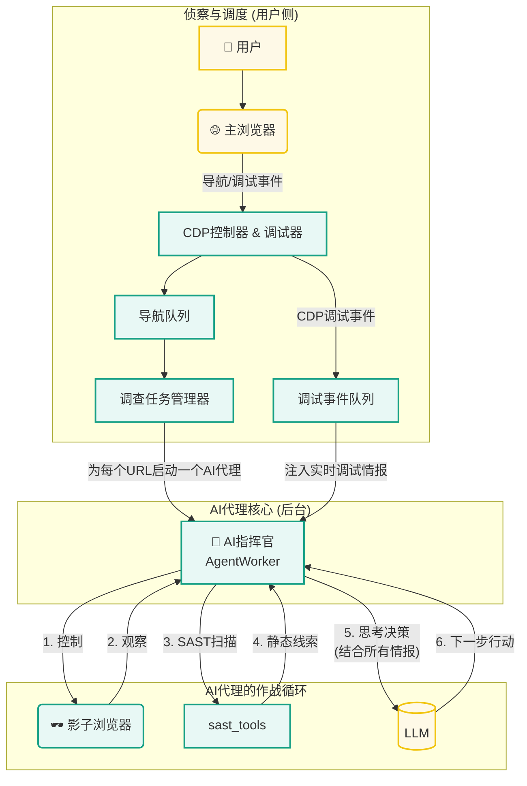
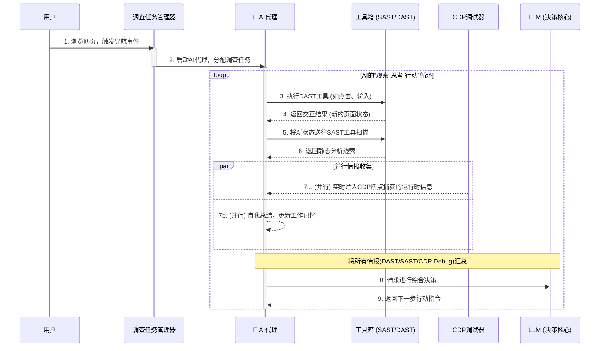

# Aegis: 混合智能与动态调试安全代理

Aegis是一个高度实验性的、前沿的Web安全审计框架。它将自主AI代理（Agent）与多种安全测试技术（SAST, DAST, IAST, Debugging）深度融合，构建了一个能够对现代Web应用进行深度、智能、自动化安全审计的终极系统。

## 核心设计思想

Aegis的最终形态，由三大核心理念驱动，旨在最大限度地模仿一位顶尖安全专家的思维与工作流：

1.  **“影子调查员”**: Aegis在后台的“影子浏览器”中，对用户访问过的页面发起主动的、探索性的安全调查，而完全不干扰用户的正常浏览。它提供了被动式扫描的无感体验，但具备主动式测试的强大能力。

2.  **“AI指挥官 + 多维情报源”**: Aegis不单纯依赖LLM的通用推理。它为“AI指挥官”(`AgentWorker`)配备了三大多维度的情报来源：
    *   **静态分析(SAST)**: `sast_tools`中的Python“脚本尖兵”负责高速、精准地发现模式化的静态线索（如密钥、危险函数）。
    *   **动态分析(DAST)**: `browser_tools`和`network_tools`是AI的“双手”，使其能与网站进行动态交互（点击、输入）和精确的发包测试。
    *   **运行时调试(Debugging)**: `CDPDebugger`是AI的“窃听器”，通过在关键事件（如`click`）上设置断点，它能捕获到事件发生瞬间的JS运行时状态（如变量值），为AI提供无与伦比的“铁证”。

3.  **“双记忆系统” (可持续学习)**: 为了解决长期运行和上下文窗口限制的矛盾，Aegis为AI代理设计了双记忆系统：
    *   **长期记忆 (RAG)**: 基于ChromaDB，允许AI从过去相似架构的网站分析中学习经验。
    *   **工作记忆 (Summarization)**: AI在执行多步任务时，会通过LLM调用进行“自我总结”，将冗长的历史记录浓缩成简短的“状态摘要”，以防止上下文窗口溢出。

## 技术栈

- **核心框架**: Python, asyncio
- **浏览器自动化**: Playwright
- **AI模型调用**: OpenAI 兼容 API（如 LM Studio / Ollama / OpenAI）
- **HTTP客户端**: httpx
- **静态分析**: 内置的Python脚本 (`sast_tools`)
- **长期记忆**: ChromaDB

## 工作原理

### 最终架构图



### 工作流时序图



## 安装与使用
### 前置要求
- Python 3.10+
- Chrome/Chromium 浏览器
- 支持的LLM服务 (本地 LM Studio / Ollama / 其他 OpenAI 兼容 API 服务)

1.  **安装依赖**: 
    确保您的系统已安装Python 3.10+。然后运行：
    ```bash
    pip install -r requirements.txt
    ```

2.  **启动Chrome浏览器**: 
    Aegis需要连接到一个开启了远程调试端口的Chrome实例。请先关闭所有Chrome进程，然后使用您的系统对应的命令启动它：
    ```bash
    # Windows
    "C:\Program Files\Google\Chrome\Application\chrome.exe" --remote-debugging-port=9222

    # macOS
    /Applications/Google\ Chrome.app/Contents/MacOS/Google\ Chrome --remote-debugging-port=9222

    # Linux
    google-chrome --remote-debugging-port=9222
    ```

3.  **配置Aegis**: 
    打开 `config.yaml` 文件进行配置。
    - **`whitelist_domains`**: **（重要）** 将您要测试的域名或IP地址加入白名单。
    - **`browser_pool`**: 
        - **`mode`**: **（v2.0新增）** 选择浏览器池模式
            - `shared`: 共享主浏览器的认证状态（推荐）
            - `standalone`: 独立浏览器但复制认证
        - `pool_size`: 并发扫描数量
    - **`llm_service`**:
        - 使用与 OpenAI 兼容的 API 服务（如本地 LM Studio / Ollama 的 openai 兼容模式）。
        - 在 `api_config` 中配置 `base_url`、`model_name`、`api_key` 与 `timeout`。

4.  **运行Aegis**: 
    ```bash
    playwright install
    python main.py
    ```
    程序启动后，您只需在主浏览器中正常浏览网页。Aegis的“侦察兵”会监控您的导航，并自动派遣“AI指挥官”在后台对您访问的页面进行自主的、混合式的安全审计。所有AI的思考过程和决策都会实时打印在Aegis的终端中。

5.  **登录目标网站**: 
    - 在Chrome中正常登录您要测试的网站
    - 完成任何需要的人工验证（如验证码）
    - Aegis会自动同步认证状态到影子浏览器

6.  **查看结果**: 
    - **实时对话**: 在Aegis运行的终端中，可以直接看到AI的思考和决策过程。
    - **最终报告**: 在`./reports`目录下，会为每个目标生成一份详细的Markdown格式审计报告。
    - **AI对话存档**: 在`./logs`目录下，`ai_dialogues.jsonl`文件会完整记录每一次与AI的对话。

## 工作模式

### 共享模式（推荐）
- 影子浏览器在主浏览器中创建新标签页
- 自动共享cookies、localStorage和session
- 支持测试需要登录的功能
- 资源消耗低

### 独立模式
- 创建独立的headless浏览器实例
- 复制主浏览器的认证状态
- 更好的隔离性
- 适合敏感环境

## 安全注意事项

⚠️ **重要警告**：
- 只对您有权测试的网站进行扫描
- 必须配置白名单域名以避免意外扫描
- 不要在生产环境直接使用
- 注意扫描频率以避免对目标服务器造成压力

## 未来规划 (Roadmap)

Aegis 框架仍在快速演进中，以下是一些计划中的、能带来质变的功能迭代方向：

- [ ] **优化导航事件处理与增量分析 (Optimize Navigation & Incremental Analysis)**
  - **描述**: 引入“URL端点规范化”逻辑，以区分“新页面导航”和“同一页面的参数状态变化”。当前，任何URL参数的变化都会触发一次完整的、重量级的分析，效率低下。
  - **优化方案**: 
    - `CDPController`在捕获导航时，将URL规范化（去除查询参数和片段），以识别基础“端点”。
    - `InvestigationManager`将只对**新的端点**启动一次重量级的`AgentWorker`进行环境初始化。
    - 对于**已见过的端点**（仅参数变化），将跳过重量级分析，仅触发轻量级的、针对URL参数的专项分析。
  - **价值**: 避免对同一页面的重复性重量级分析，极大提升被动扫描模式的效率和智能性，将资源集中在刀刃上。

- [ ] **构建高级DAST引擎 (PoC-Driven DAST Engine)**
  - **描述**: 将当前的DAST测试升级为一个可编排、支持复杂PoC的工作流引擎，使其接近Nuclei等专业工具的能力。这套引擎将深刻理解HTTP请求的全部细节，包括URL参数、POST Body、请求头、MIME类型等，并能将多个请求串联成有逻辑的攻击链，极大赋能自主模式和被动模式的分析深度。
  - **已完成**: 
    - [x] 将Payloads从硬编码重构为外部JSON/YAML文件 (`src/dast_payloads/`)。
    - [x] 实现了SSTI漏洞检测的原型。
  - **待办 (TODO)**:
    - [ ] **定义PoC格式**: 设计一套机器可读的YAML格式，用于描述多步请求、变量提取、结果断言等复杂的测试流程。
    - [ ] **实现状态化引擎**: 重构`InteractionWorker`，使其能维持状态，支持需要上下文关联的多步测试（例如，从上一个请求中提取Token，用于下一个请求）。
    - [ ] **增强匹配器 (Matcher)**: 实现更强大的结果断言能力，支持基于状态码、响应头、正则表达式、DSL等多种条件的判断。
    - [ ] **支持带外检测 (OOB)**: 增加对SSRF等带外漏洞的检测支持，允许用户在`config.yaml`中配置自己的Callback服务器地址（如Collaborator, CEYE, DNSLog）。

- [ ] **实现“分析-验证”闭环 (Analyze-Verify Loop)**
  - **描述**: 在高级DAST引擎的基础上，实现`情报收集 -> AI分析（形成漏洞假设） -> AI生成PoC -> DAST引擎执行PoC -> 验证结果 -> 最终确认报告`的完整闭环。
  - **价值**: 这将是消除误报、提升报告准确率的决定性功能。最终产出的漏洞将是100%经过机器复现和确认的，极大提升了报告的可信度和实用性。

- [ ] **增强启动逻辑与多标签页处理 (Robust Startup & Multi-Tab Handling)**
  - **描述**: 优化程序启动时的行为。当前，Aegis只监听启动后新发生的导航，并从第一个标签页复制认证。优化后的逻辑将：1. 在启动时扫描所有已打开的标签页，将符合白名单的页面自动加入初始任务队列。2. 智能地从已登录的、在白名单内的标签页中复制认证状态，而不是盲目地选择第一个。
  - **价值**: 极大地改善用户体验，完美支持“先打开并登录多个目标网站，再启动Aegis”的工作流，使其行为更符合直觉和实际使用场景。
- 
- [ ] **吸取fenjing、xscan、sqlmap等工具的优秀经验辅助判断漏洞**
