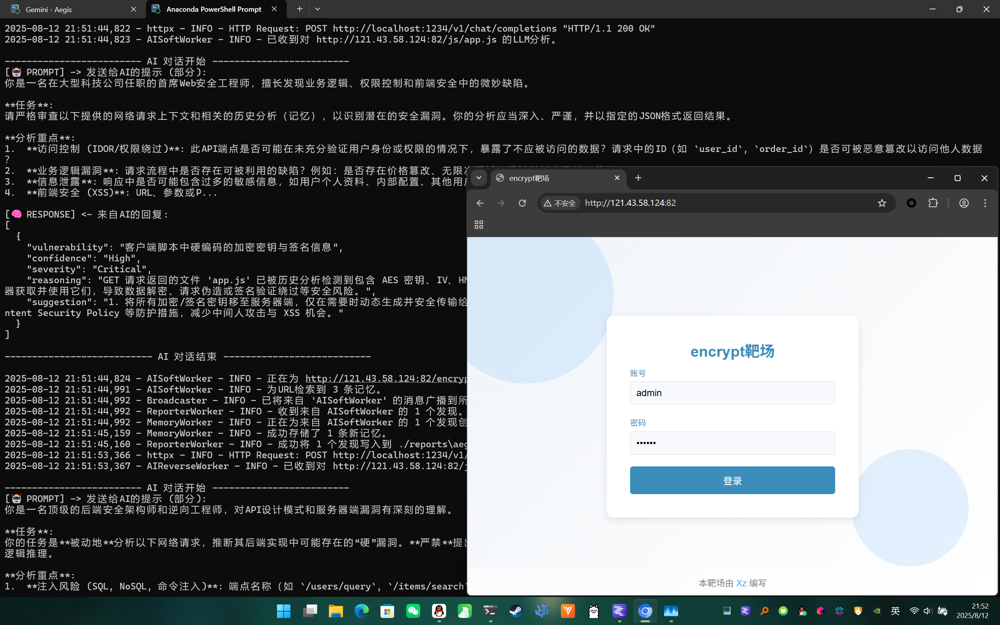

# Aegis - AI驱动的被动式网站安全扫描器

这是我灵机一动的产物，虽然理念很简单，但作为我第一个AI项目，还是难度很大的，调提示词、做设计，搜了很多AI开发的东西，本来想干脆Dify妥妥拽拽，但还是咬咬牙做了这个，我打算作为一个接入CDP的前端“软漏洞”分析器，辅助测试人员分析网站功能和接口鉴权问题、XSS等网站问题。
这个项目的完成标准，我打算定为：能静态+动态分析通关JS逆向的encrypt labs靶场。之后会拓展成被动扫描器+AI动态分析助手，还会和Burp联动。敬请期待吧。（超多Vibe Coding，需要长久代码审查和维护）

## 核心理念

Aegis 是一个由AI驱动的创新性“网站被动扫描器”。它旨在通过理解前端代码、交互逻辑和业务流程来发现安全漏洞，而不是依赖传统的Payload注入攻击。其核心是赋予AI强大的分析能力，同时将其严格限制在安全沙箱内，确保扫描过程的绝对安全。

## 主要功能

- **安全的动态分析**：通过开放Chrome DevTools Protocol (CDP)接口，AI能够像测试人员一样与前端进行交互、检查和调试，但所有操作均在浏览器沙箱内进行，不发送任何攻击性网络数据包。
- **专注“软”漏洞**：主要分析前端漏洞、业务逻辑缺陷、权限控制（Authentication/Authorization）问题和跨站脚本（XSS）等复杂漏洞。
- **“硬”漏洞分析与推测**：对于SQL注入、远程代码执行（RCE）等服务器端漏洞，Aegis通过分析代码逻辑和网络请求来**推测**其可能性，但**不进行**实际的攻击性测试。
- **上下文感知**：AI基于对应用上下文的理解进行漏洞判断，减少误报，发现传统扫描器难以覆盖的漏洞。

## 项目架构

关于详细的程序架构和业务流程，请参考项目中的 `structure.txt` 和 `workflow.txt` 文件。

## 技术栈

- **后端**: Python
- **AI模型**: 本地部署的 `lm-studio` 服务，运行 `gpt-oss` 模型
- **核心技术**: Chrome DevTools Protocol (CDP)

## 如何使用

1.  **安装依赖**:
    ```bash
    pip install -r requirements.txt
    ```
2.  **配置环境**:
    根据 `config.yaml` 文件，配置模型地址等参数。
3.  **启动程序**:
    ```bash
    python main.py
    ```
    
