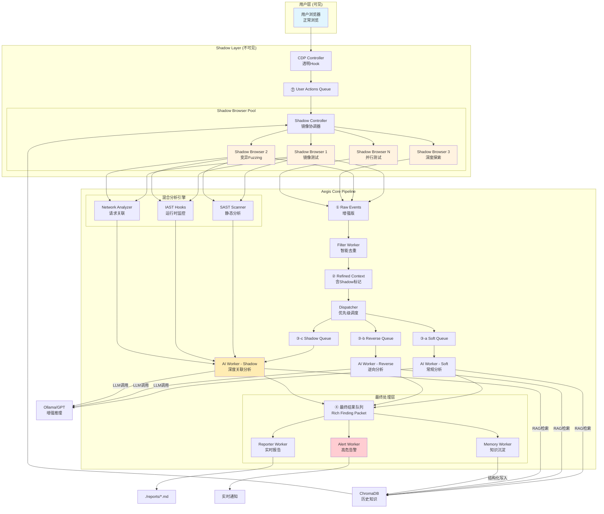
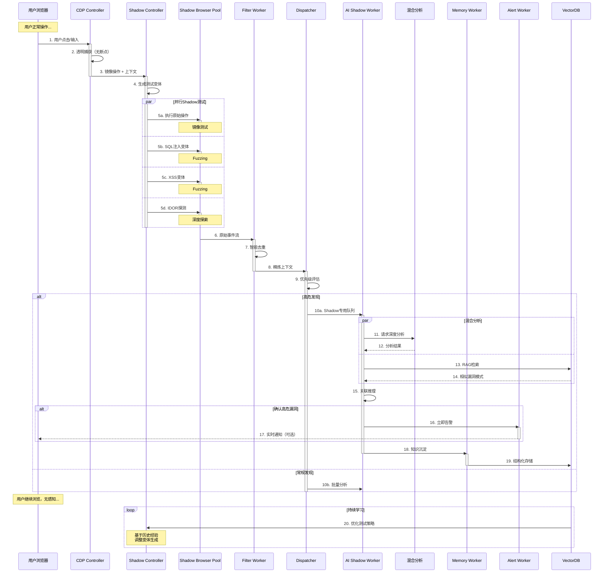

# Aegis Shadow Browser 增强架构设计

## 1. 增强后的完整架构图



## 2. 增强的时序图



## 3. 核心组件详细设计

### 3.1 增强的CDP Controller

```python
class EnhancedCDPController:
    """
    增强版CDP控制器 - 完全透明的操作捕获
    """
    
    def __init__(self, output_q: Queue, shadow_q: Queue, config: dict):
        self.output_q = output_q  # 原有的Raw Events队列
        self.shadow_q = shadow_q  # 新增的Shadow队列
        self.config = config
        self.user_context = {}  # 用户上下文
        self.operation_fingerprints = set()  # 操作指纹，用于去重
        
    async def setup_transparent_hooks(self, page: Page):
        """设置完全透明的钩子 - 不使用断点"""
        cdp = await page.context.new_cdp_session(page)
        
        # 启用必要的域，但不设置断点
        await cdp.send('Runtime.enable')
        await cdp.send('DOM.enable') 
        await cdp.send('Network.enable')
        await cdp.send('Page.enable')
        
        # 注入JavaScript监听器（比CDP事件更轻量）
        await page.add_init_script("""
            // 轻量级事件捕获
            const aegisCapture = {
                queue: [],
                
                capture: function(type, data) {
                    this.queue.push({
                        type: type,
                        data: data,
                        timestamp: Date.now(),
                        url: window.location.href
                    });
                    
                    // 批量发送，避免频繁通信
                    if (this.queue.length >= 10) {
                        this.flush();
                    }
                },
                
                flush: function() {
                    if (this.queue.length > 0) {
                        window.__aegisShadowCapture__(this.queue);
                        this.queue = [];
                    }
                }
            };
            
            // 监听点击
            document.addEventListener('click', (e) => {
                aegisCapture.capture('click', {
                    selector: e.target.tagName + (e.target.id ? '#' + e.target.id : ''),
                    text: e.target.innerText?.substring(0, 50),
                    href: e.target.href
                });
            }, true);
            
            // 监听输入
            document.addEventListener('input', (e) => {
                aegisCapture.capture('input', {
                    selector: e.target.name || e.target.id,
                    type: e.target.type,
                    // 不记录密码
                    value: e.target.type === 'password' ? '[REDACTED]' : e.target.value
                });
            }, true);
            
            // 监听表单提交
            document.addEventListener('submit', (e) => {
                const formData = new FormData(e.target);
                const data = {};
                formData.forEach((value, key) => {
                    data[key] = key.includes('password') ? '[REDACTED]' : value;
                });
                
                aegisCapture.capture('submit', {
                    action: e.target.action,
                    method: e.target.method,
                    data: data
                });
            }, true);
            
            // 定期flush
            setInterval(() => aegisCapture.flush(), 2000);
        """)
        
        # 暴露函数接收批量事件
        await page.expose_function('__aegisShadowCapture__', self.on_batch_capture)
    
    async def on_batch_capture(self, events: List[Dict]):
        """处理批量捕获的事件"""
        for event in events:
            # 生成操作指纹，避免重复
            fingerprint = f"{event['type']}:{event['url']}:{event.get('data', {}).get('selector', '')}"
            
            if fingerprint not in self.operation_fingerprints:
                self.operation_fingerprints.add(fingerprint)
                
                # 发送到Shadow队列
                await self.shadow_q.put({
                    'type': 'user_action',
                    'action': event,
                    'context': await self.extract_context()
                })
```

### 3.2 Shadow Controller - 核心协调器

```python
class ShadowController:
    """
    Shadow Browser的核心协调器
    负责镜像用户操作并生成智能测试变体
    """
    
    def __init__(self, shadow_q: Queue, output_q: Queue, browser_pool: BrowserPool):
        self.shadow_q = shadow_q
        self.output_q = output_q
        self.browser_pool = browser_pool
        self.test_generator = TestVariantGenerator()
        self.scheduler = ShadowScheduler()
        self.context_sync = ContextSynchronizer()
        
        # 性能优化
        self.test_cache = LRUCache(maxsize=1000)  # 缓存测试结果
        self.pending_tests = asyncio.Queue(maxsize=1000)
        self.active_shadows = []
        
    async def run(self):
        """主循环"""
        # 启动Shadow Workers
        for i in range(self.browser_pool.size):
            worker = asyncio.create_task(self.shadow_worker(i))
            self.active_shadows.append(worker)
        
        # 处理用户操作
        while True:
            try:
                # 获取用户操作
                user_action = await asyncio.wait_for(
                    self.shadow_q.get(), 
                    timeout=1.0
                )
                
                # 生成测试变体
                variants = await self.test_generator.generate_smart_variants(
                    user_action,
                    self.get_historical_context()
                )
                
                # 调度测试
                for variant in variants:
                    priority = self.calculate_priority(variant)
                    await self.pending_tests.put((priority, variant))
                
            except asyncio.TimeoutError:
                # 用户空闲，执行深度测试
                await self.execute_deep_exploration()
    
    async def shadow_worker(self, worker_id: int):
        """Shadow Browser工作进程"""
        shadow_browser = await self.browser_pool.acquire_shadow()
        
        while True:
            try:
                # 获取测试任务
                priority, test = await self.pending_tests.get()
                
                # 检查缓存
                cache_key = self.generate_cache_key(test)
                if cache_key in self.test_cache:
                    continue
                
                # 同步上下文
                await self.context_sync.sync_context(shadow_browser)
                
                # 执行测试
                result = await self.execute_test(shadow_browser, test)
                
                # 缓存结果
                self.test_cache[cache_key] = result
                
                # 发送到分析管道
                if result['interesting']:
                    await self.output_q.put({
                        'source': 'shadow',
                        'worker_id': worker_id,
                        'test': test,
                        'result': result,
                        'timestamp': time.time()
                    })
                    
            except Exception as e:
                logging.error(f"Shadow worker {worker_id} error: {e}")
```

### 3.3 智能测试变体生成器

```python
class TestVariantGenerator:
    """
    基于上下文和历史的智能测试变体生成
    """
    
    def __init__(self):
        self.payload_db = PayloadDatabase()
        self.pattern_recognizer = PatternRecognizer()
        self.ml_model = load_model('variant_predictor.pkl')  # ML模型预测有效变体
        
    async def generate_smart_variants(self, action: Dict, context: Dict) -> List[Dict]:
        """
        生成智能测试变体
        基于：操作类型、上下文、历史成功率
        """
        variants = []
        action_type = action['type']
        
        # 1. 基础变体（始终生成）
        variants.extend(self.generate_basic_variants(action))
        
        # 2. 上下文相关变体
        if context.get('auth_state') == 'logged_in':
            variants.extend(self.generate_auth_variants(action))
        
        # 3. ML预测的高价值变体
        predicted_variants = self.ml_model.predict(action, context)
        variants.extend(predicted_variants[:5])  # Top 5
        
        # 4. 基于历史成功的变体
        historical_variants = await self.get_historical_success_variants(action_type)
        variants.extend(historical_variants)
        
        # 5. 智能去重和优先级排序
        variants = self.deduplicate_and_prioritize(variants)
        
        return variants[:20]  # 限制数量，避免过载
    
    def generate_basic_variants(self, action: Dict) -> List[Dict]:
        """基础安全测试变体"""
        variants = []
        
        if action['type'] == 'input':
            field_name = action['data'].get('selector', '').lower()
            
            # 智能识别字段类型
            if any(keyword in field_name for keyword in ['search', 'query', 'q']):
                # 搜索框 - XSS为主
                variants.extend([
                    self.create_variant(action, 'xss', ''),
                    self.create_variant(action, 'xss', '"><script>alert(1)</script>'),
                    self.create_variant(action, 'ssti', '{{7*7}}'),
                ])
            elif any(keyword in field_name for keyword in ['email', 'mail']):
                # 邮箱 - 注入测试
                variants.extend([
                    self.create_variant(action, 'sqli', "admin'--"),
                    self.create_variant(action, 'nosqli', '{"$ne": null}'),
                ])
            elif any(keyword in field_name for keyword in ['url', 'link', 'website']):
                # URL字段 - SSRF/Open Redirect
                variants.extend([
                    self.create_variant(action, 'ssrf', 'http://169.254.169.254/'),
                    self.create_variant(action, 'redirect', 'javascript:alert(1)'),
                ])
            elif any(keyword in field_name for keyword in ['file', 'upload', 'path']):
                # 文件相关 - 路径遍历
                variants.extend([
                    self.create_variant(action, 'traversal', '../../../etc/passwd'),
                    self.create_variant(action, 'traversal', '..\\..\\..\\windows\\system32\\config\\sam'),
                ])
                
        elif action['type'] == 'click':
            url = action['data'].get('href', '')
            if '/api/' in url or '.json' in url:
                # API端点 - 测试未授权
                variants.extend([
                    self.create_variant(action, 'unauth', remove_auth=True),
                    self.create_variant(action, 'idor', increment_id=True),
                ])
                
        return variants
```

### 3.4 Shadow专用AI Worker

```python
class ShadowAIWorker:
    """
    专门处理Shadow测试结果的AI Worker
    具有更强的关联分析能力
    """
    
    def __init__(self, config: dict, vector_db: ChromaDB):
        self.config = config
        self.vector_db = vector_db
        self.correlation_engine = CorrelationEngine()
        self.exploit_chain_builder = ExploitChainBuilder()
        
    async def analyze(self, shadow_results: List[Dict]) -> Dict:
        """
        深度分析Shadow测试结果
        寻找漏洞链和复杂攻击路径
        """
        
        # 1. 关联分析 - 寻找相关漏洞
        correlations = self.correlation_engine.find_correlations(shadow_results)
        
        # 2. 构建攻击链
        exploit_chains = []
        for correlation in correlations:
            chain = await self.exploit_chain_builder.build_chain(correlation)
            if chain:
                exploit_chains.append(chain)
        
        # 3. AI推理 - 评估严重性和可利用性
        prompt = self.build_analysis_prompt(shadow_results, correlations, exploit_chains)
        ai_analysis = await self.call_llm(prompt)
        
        # 4. 生成结构化报告
        return {
            'vulnerabilities': self.extract_vulnerabilities(ai_analysis),
            'exploit_chains': exploit_chains,
            'risk_score': self.calculate_risk_score(ai_analysis),
            'recommendations': self.generate_recommendations(ai_analysis),
            'evidence': shadow_results
        }
```

### 3.5 实时告警系统

```python
class AlertWorker:
    """
    实时告警系统
    对高危漏洞立即通知
    """
    
    def __init__(self, config: dict):
        self.config = config
        self.alert_threshold = config.get('alert_threshold', 'high')
        self.notification_channels = self.setup_channels(config)
        
    async def process_finding(self, finding: Dict):
        """处理发现，决定是否告警"""
        
        severity = finding.get('severity', 'low')
        confidence = finding.get('confidence', 0)
        
        # 高危漏洞立即告警
        if severity == 'critical' and confidence > 0.8:
            await self.send_immediate_alert(finding)
            
        # 可利用的漏洞链告警
        elif finding.get('exploit_chain') and confidence > 0.7:
            await self.send_exploit_chain_alert(finding)
            
        # 批量中危漏洞汇总告警
        elif severity == 'high':
            self.queue_for_batch_alert(finding)
    
    async def send_immediate_alert(self, finding: Dict):
        """发送即时告警"""
        alert = {
            'title': f"🚨 发现{finding['vulnerability']}漏洞",
            'severity': finding['severity'],
            'url': finding['url'],
            'description': finding['description'],
            'poc': finding.get('poc', 'N/A'),
            'timestamp': datetime.now().isoformat()
        }
        
        # 多渠道通知
        for channel in self.notification_channels:
            await channel.send(alert)
```

## 4. 性能优化策略

### 4.1 智能调度
```python
class ShadowScheduler:
    """智能调度，优化资源使用"""
    
    def __init__(self):
        self.user_activity_monitor = UserActivityMonitor()
        self.resource_monitor = ResourceMonitor()
        
    async def schedule(self, tests: List[Dict]) -> List[Dict]:
        """智能调度测试"""
        
        # 1. 检测用户活跃度
        user_activity = self.user_activity_monitor.get_activity_level()
        
        # 2. 检查系统资源
        cpu_usage = self.resource_monitor.get_cpu_usage()
        memory_usage = self.resource_monitor.get_memory_usage()
        
        # 3. 动态调整并发数
        if user_activity == 'idle' and cpu_usage < 50:
            max_concurrent = 10  # 用户空闲，加大测试力度
        elif user_activity == 'active' and cpu_usage > 70:
            max_concurrent = 2   # 用户活跃且系统负载高，减少测试
        else:
            max_concurrent = 5   # 默认
            
        # 4. 优先级排序
        tests.sort(key=lambda x: x.get('priority', 0), reverse=True)
        
        return tests[:max_concurrent]
```

### 4.2 结果缓存
```python
class TestResultCache:
    """测试结果缓存，避免重复测试"""
    
    def __init__(self, max_size: int = 10000):
        self.cache = LRUCache(maxsize=max_size)
        self.bloom_filter = BloomFilter(capacity=100000, error_rate=0.001)
        
    def should_test(self, test: Dict) -> bool:
        """判断是否需要测试"""
        test_hash = self.compute_hash(test)
        
        # 快速判断（Bloom Filter）
        if test_hash in self.bloom_filter:
            # 可能存在，进一步检查
            if test_hash in self.cache:
                # 确实已测试
                return False
                
        return True
    
    def add_result(self, test: Dict, result: Dict):
        """添加测试结果"""
        test_hash = self.compute_hash(test)
        self.bloom_filter.add(test_hash)
        self.cache[test_hash] = {
            'result': result,
            'timestamp': time.time()
        }
```

## 5. 知识沉淀增强

### 5.1 Memory Worker增强
```python
class EnhancedMemoryWorker:
    """增强的记忆工作器"""
    
    async def process_shadow_findings(self, findings: List[Dict]):
        """处理Shadow测试发现，提取知识"""
        
        knowledge = {
            'successful_payloads': [],
            'vulnerable_patterns': [],
            'exploit_chains': [],
            'defense_mechanisms': []
        }
        
        for finding in findings:
            # 提取成功的payload
            if finding['success']:
                knowledge['successful_payloads'].append({
                    'payload': finding['payload'],
                    'context': finding['context'],
                    'effectiveness': finding['confidence']
                })
            
            # 识别漏洞模式
            pattern = self.extract_pattern(finding)
            if pattern:
                knowledge['vulnerable_patterns'].append(pattern)
        
        # 向量化存储
        await self.vector_db.add_knowledge(knowledge)
```

## 6. 完整工作流示例

```python
# 用户操作
用户: 点击 "查看订单" 按钮

# Shadow Browser 并行执行
Shadow 1: 点击 "查看订单" (镜像)
Shadow 2: 点击 "查看订单?id=2" (IDOR测试) 
Shadow 3: 点击 "查看订单&admin=true" (权限提升)
Shadow 4: 无Cookie点击 (未授权测试)
Shadow 5: 点击 "../admin/orders" (路径遍历)

# 发现漏洞
Shadow 2: ✅ 成功查看其他用户订单 (IDOR确认)
Shadow 4: ✅ 无需登录可查看 (未授权访问)

# AI分析
AI Shadow Worker: 
- 发现IDOR + 未授权组合漏洞
- 严重性: Critical
- 可导致全部用户数据泄露

# 实时告警
Alert: 🚨 发现严重IDOR漏洞，可查看所有用户订单

# 知识沉淀
Memory: 存储 "订单系统+IDOR+未授权" 模式

# 用户体验
用户: 正常查看自己的订单，完全无感知
```

## 7. 实施路线图

### Phase 1: 基础架构 (Week 1)
- ✅ 实现透明CDP Hook
- ✅ 创建Shadow Controller
- ✅ 集成到现有Queue系统

### Phase 2: 智能测试 (Week 2)
- ✅ 实现TestVariantGenerator
- ✅ 添加ML预测模型
- ✅ 优化测试调度

### Phase 3: 深度分析 (Week 3)
- ✅ 实现Shadow AI Worker
- ✅ 添加关联分析引擎
- ✅ 构建攻击链识别

### Phase 4: 优化完善 (Week 4)
- ✅ 性能优化
- ✅ 添加实时告警
- ✅ 完善知识沉淀

这个架构设计实现了：
1. **完全用户无感** - 透明Hook，不影响体验
2. **深度全面测试** - 每个操作触发数十个变体
3. **智能关联分析** - AI深度推理漏洞链
4. **实时告警机制** - 高危漏洞立即通知
5. **持续学习优化** - 基于历史不断改进
