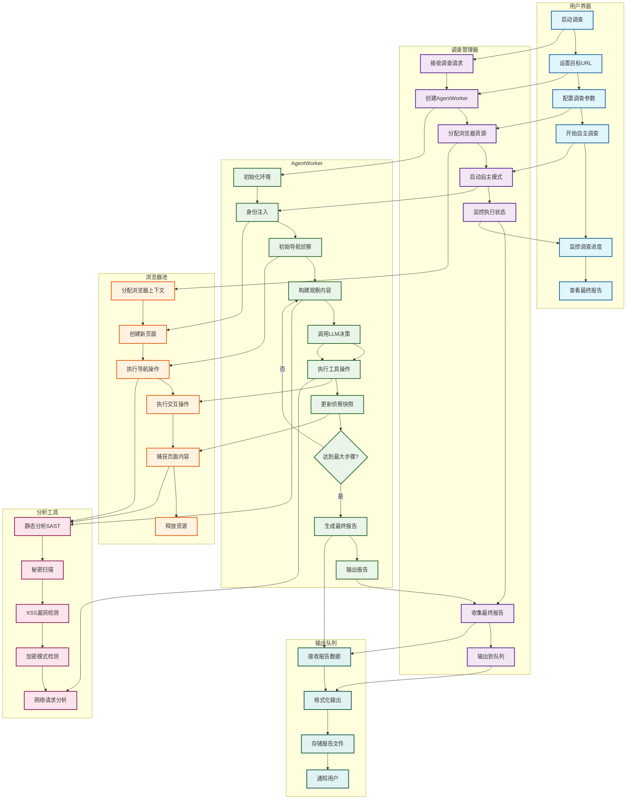
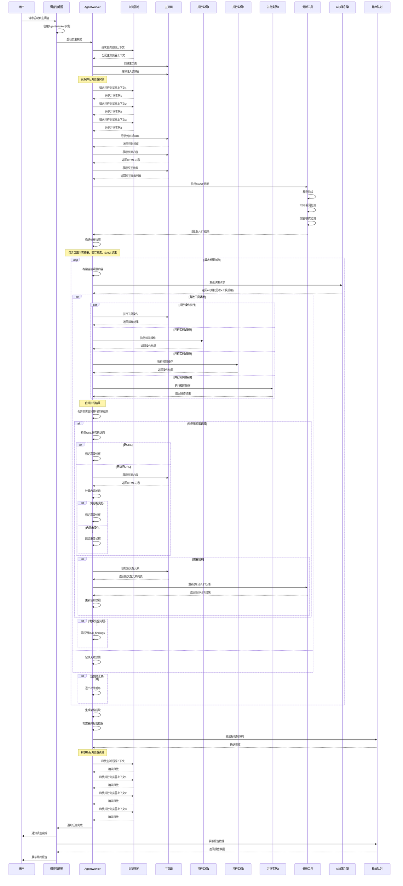
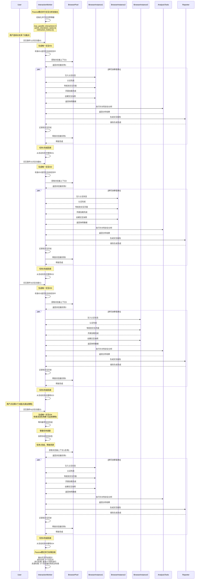

# Autonomous模式工作流程图

## 泳道图 (Swimlane Diagram)

## 时序图 (Sequence Diagram)

## 组件说明

### 1. 用户界面 (User Interface)
- **职责**: 提供用户交互界面，接收调查请求和配置参数
- **关键功能**: 启动调查、设置目标、监控进度、查看报告

### 2. 调查管理器 (Investigation Manager)
- **职责**: 管理调查任务的生命周期，协调各个Worker
- **关键功能**: 创建AgentWorker、分配资源、监控执行、收集报告

### 3. AgentWorker
- **职责**: 执行自主调查的核心逻辑，实现AI驱动的安全测试
- **关键功能**: 
  - 环境初始化和身份注入
  - 初始侦察和快照构建
  - LLM决策调用和工具执行
  - 页面跳转检测和侦察更新
  - 最终报告生成

### 4. 浏览器池 (Browser Pool)
- **职责**: 管理浏览器资源，提供页面操作能力
- **关键功能**: 分配/释放浏览器上下文、创建页面、执行操作

### 5. 分析工具 (Analysis Tools)
- **职责**: 提供各种安全分析能力
- **关键功能**: 
  - SAST静态分析(秘密扫描、XSS检测、加密模式检测)
  - 网络请求分析

### 6. 输出队列 (Output Queue)
- **职责**: 处理报告输出和存储
- **关键功能**: 接收报告数据、格式化输出、存储文件

## 工作流程特点

### 1. 自主决策
- AgentWorker通过LLM进行自主决策，无需人工干预
- 基于当前观察和历史记录做出智能判断
- 支持多种工具操作的自动执行

### 2. 持续侦察
- 在页面跳转时自动重新进行侦察
- 动态更新侦察快照，保持信息最新
- 支持多步骤深度调查

### 3. 智能分析
- 结合SAST和动态分析技术
- AI驱动的漏洞识别和风险评估
- 自动生成结构化安全报告

### 4. 智能重复检测
- **URL历史记录机制**: 系统维护已访问URL集合(`visited_urls`)，避免重复侦察相同页面
- **页面内容哈希比对**: 使用`url_content_hashes`字典存储页面内容哈希值，仅当页面内容发生变化时才重新侦察
- **页面刷新时跳过重复侦察**: 检测到页面刷新时，如果URL和内容哈希都未变化，则跳过重复侦察
- **提升调查效率**: 显著减少不必要的重复侦察，提升运行效率并优化资源消耗

### 5. 并行处理优化
- **Autonomous模式并行测试**: 可同时获取最多3个浏览器上下文(受浏览器池大小限制)，并行测试多个功能点
- **主页面与并行实例协同**: 主页面(`main_page`)负责主要侦察决策，并行实例执行相同操作并收集结果
- **任务结果合并**: 并行任务完成后，结果合并到历史记录(`history`)中，确保数据完整性
- **Passive模式并行交互**: 为每个用户交互事件分配独立的影子浏览器实例，支持同时分析多个交互点
- **交互任务管理**: 使用`active_interaction_tasks`字典跟踪进行中的交互分析任务，避免资源冲突
- **智能任务调度**: 当并行任务数超过限制时，等待最早任务完成后再处理新任务，确保系统稳定性

### 6. 资源管理
- **浏览器池管理**: 支持多个浏览器实例并行工作，提高资源利用率
- **认证状态同步**: 在并行实例间保持认证状态一致性
- **内存优化**: 及时释放不再需要的浏览器上下文，避免内存泄漏

### 7. 完整生命周期
- **初始化阶段**: 配置调查参数，获取浏览器上下文，进行初始侦察
- **调查循环**: AI决策 → 工具调用 → 结果分析 → 页面跳转检测 → 重新侦察
- **结束阶段**: 生成调查报告，释放资源，输出最终结果

## Passive模式并行处理时序图

## 与Passive模式的对比

| 特性 | Autonomous模式 | Passive模式 |
|------|---------------|-------------|
| 决策方式 | AI自主决策 | 等待用户交互 |
| 侦察时机 | 启动时+页面跳转时 | 仅用户交互后 |
| 分析深度 | 多步骤深度调查 | 单次交互分析 |
| 适用场景 | 全面安全审计 | 实时交互监控 |
| 资源消耗 | 较高 | 较低 |
| 响应速度 | 较慢 | 实时 |