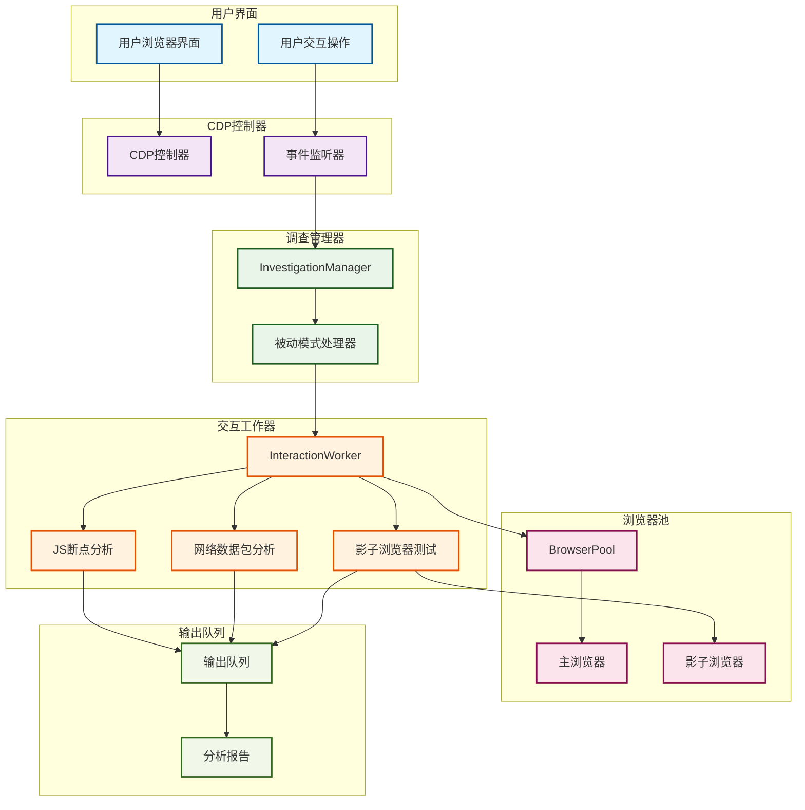
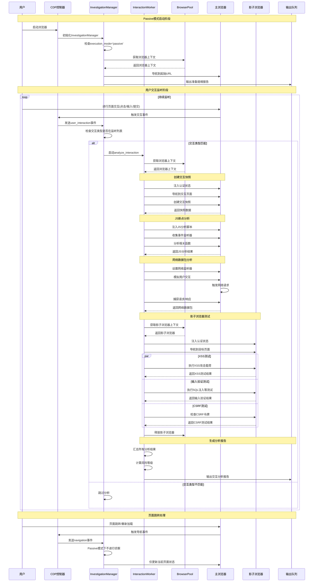

# Passive模式工作流程图表

## 泳道图 (Swimlane Diagram)

## 时序图 (Sequence Diagram)

## 组件说明

### 主要组件

1. **用户界面 (User Interface)**
   - 用户浏览器界面
   - 用户交互操作（点击、输入、提交）

2. **CDP控制器 (CDP Controller)**
   - 监听浏览器事件
   - 事件分发和处理

3. **调查管理器 (InvestigationManager)**
   - 被动模式处理器
   - 交互事件过滤和分发

4. **交互工作器 (InteractionWorker)**
   - JS断点分析器
   - 网络数据包分析器
   - 影子浏览器测试器

5. **浏览器池 (BrowserPool)**
   - 主浏览器（用户交互）
   - 影子浏览器（安全测试）

6. **输出队列 (Output Queue)**
   - 分析报告生成
   - 结果汇总和输出

### 工作流程特点

1. **被动监听**
   - 不主动进行页面侦察
   - 仅响应实际用户交互

2. **实时分析**
   - 用户交互后立即分析
   - 多维度安全检测

3. **隔离测试**
   - 影子浏览器独立测试
   - 不影响用户正常使用

4. **全面覆盖**
   - JS断点分析
   - 网络数据包分析
   - 多种安全测试